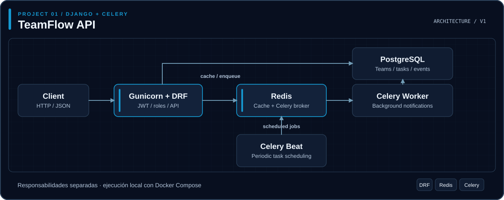
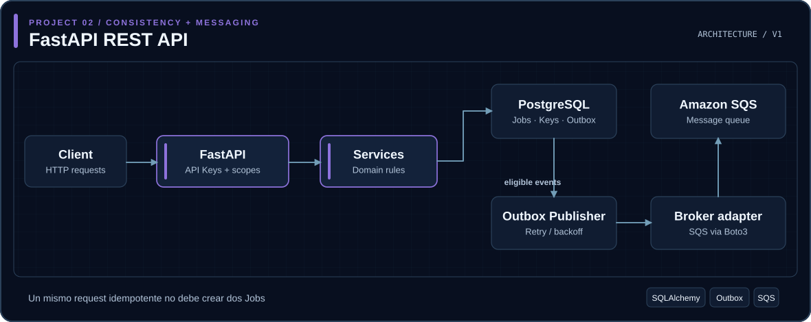
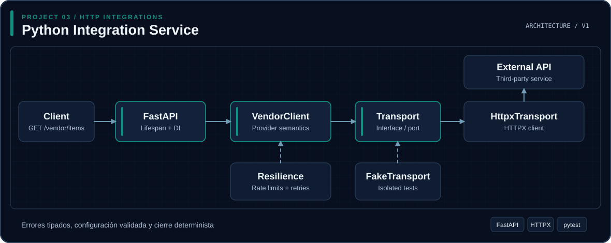

<!-- Banner adaptable al tema de GitHub -->
<picture>
  <source media="(prefers-color-scheme: dark)" srcset="assets/banner-dark.svg" />
  <source media="(prefers-color-scheme: light)" srcset="assets/banner-light.svg" />
  
</picture>

 

<!-- Texto nativo de GitHub: no depende de servidores externos ni de SVG animados -->

  <strong>Python · FastAPI · Django REST Framework · PostgreSQL</strong> 
  API Design · Integrations · Distributed Systems · AWS Serverless · Docker · CI/CD

 

  

<!-- Contador dinámico de visitas del perfil -->

---

## 👨‍💻 Sobre mí

Soy **Omar López**, ingeniero de sistemas de Colombia 🇨🇴 y **Backend Engineer especializado en Python**.

Trabajo con **Django, Django REST Framework y FastAPI** para diseñar APIs, servicios backend e integraciones mantenibles, seguras y fáciles de probar.

Me interesan especialmente los problemas que aparecen más allá de un CRUD: **autenticación, autorización, integridad transaccional, idempotencia, mensajería, procesamiento asíncrono y resiliencia**.

Mi enfoque combina diseño de software, pruebas automatizadas y decisiones de arquitectura justificadas.

- 🐍 **Especialidad principal:** Python, Django REST Framework y FastAPI.
- 🧩 **Backend:** APIs REST, autenticación, autorización e integraciones.
- 🏗️ **Arquitectura:** separación de responsabilidades, modelado de dominio y sistemas distribuidos.
- ⚙️ **Infraestructura:** PostgreSQL, Redis, Celery, Docker, GitHub Actions y AWS.
- 🌱 **Actualmente profundizando en:** Go, concurrencia, observabilidad y arquitectura orientada a eventos.

---

## 🛠️ Tecnologías

<strong>Backend y lenguajes</strong>

  

<strong>Datos, mensajería y cloud</strong>

  

<strong>Herramientas y calidad</strong>

  

También trabajo con SQLAlchemy, Alembic, Celery, Amazon SQS,
HTTPX, pytest, Ruff y CI/CD.

---

## 📊 Lenguajes más utilizados

<!-- Generado automáticamente mediante GitHub Actions -->

 

Estadísticas automáticas de mis repositorios públicos propios,
excluyendo forks y repositorios de otros colaboradores.
Los porcentajes representan distribución de código,
no niveles de experiencia profesional.

---

## 🚀 Proyectos destacados

Proyectos que demuestran **arquitectura, seguridad, persistencia, calidad e integraciones**.

Cada proyecto incluye su arquitectura simplificada, documentación técnica, código fuente y pruebas automatizadas.

### 👥 [TeamFlow API](https://github.com/Omar2709/teamflow-api)

**Django · Django REST Framework · PostgreSQL · Redis · Celery**

API colaborativa para gestionar equipos, proyectos, tareas, comentarios y notificaciones, con una arquitectura orientada a producción.

**Características principales:**

- Autenticación JWT y autorización basada en roles.
- Aislamiento de recursos entre equipos.
- Persistencia relacional mediante PostgreSQL.
- Caché y mensajería utilizando Redis.
- Procesamiento asíncrono mediante Celery.
- Tareas periódicas mediante Celery Beat.
- Contratos OpenAPI y pruebas automatizadas.
- Contenerización mediante Docker.

**Arquitectura**

<picture>
  <source media="(prefers-color-scheme: dark)" srcset="assets/architecture-teamflow-dark.svg" />
  <source media="(prefers-color-scheme: light)" srcset="assets/architecture-teamflow-light.svg" />
  
</picture>

[🔍 Ampliar diagrama](assets/architecture-teamflow-dark.svg) · [Versión clara](assets/architecture-teamflow-light.svg)

[**Código y documentación ↗**](https://github.com/Omar2709/teamflow-api) · [**Pruebas ↗**](https://github.com/Omar2709/teamflow-api/tree/main/apps) · [**Pipeline CI ↗**](https://github.com/Omar2709/teamflow-api/actions/workflows/ci.yml)

---

### ⚡ [FastAPI REST API](https://github.com/Omar2709/fastapi-rest-api)

**Python · FastAPI · PostgreSQL · SQLAlchemy · Alembic · Amazon SQS**

API orientada al estudio e implementación de patrones relacionados con consistencia, seguridad y procesamiento distribuido.

**Características principales:**

- Autenticación mediante API Keys.
- Autorización granular basada en scopes.
- Idempotencia HTTP mediante Idempotency-Key.
- Persistencia transaccional con PostgreSQL.
- Implementación del patrón Transactional Outbox.
- Separación de dominio, servicios y adaptadores.
- Integración con Amazon SQS mediante Boto3.
- Políticas de reintentos y manejo de fallos terminales.
- Pruebas automatizadas y análisis de cobertura.

**Arquitectura**

<picture>
  <source media="(prefers-color-scheme: dark)" srcset="assets/architecture-fastapi-dark.svg" />
  <source media="(prefers-color-scheme: light)" srcset="assets/architecture-fastapi-light.svg" />
  
</picture>

[🔍 Ampliar diagrama](assets/architecture-fastapi-dark.svg) · [Versión clara](assets/architecture-fastapi-light.svg)

[**Código y documentación ↗**](https://github.com/Omar2709/fastapi-rest-api) · [**Pruebas ↗**](https://github.com/Omar2709/fastapi-rest-api/tree/main/tests) · [**Pipeline CI ↗**](https://github.com/Omar2709/fastapi-rest-api/actions/workflows/ci.yml)

---

### 🔌 [Python Integration Service](https://github.com/Omar2709/python-integration-service)

**Python · FastAPI · HTTPX · Pydantic · pytest**

Servicio backend enfocado en integraciones con APIs externas, diseñado para desacoplar la lógica de negocio de los mecanismos de comunicación.

**Características principales:**

- Abstracción de transporte HTTP.
- Inyección explícita de dependencias.
- Gestión del ciclo de vida del cliente HTTP.
- Configuración validada con Pydantic Settings.
- Excepciones especializadas de integración.
- Tratamiento de errores HTTP, timeouts y rate limits.
- Políticas configurables de reintentos.
- Pruebas aisladas mediante dobles de prueba.
- Integración continua con GitHub Actions.

**Arquitectura**

<picture>
  <source media="(prefers-color-scheme: dark)" srcset="assets/architecture-integration-dark.svg" />
  <source media="(prefers-color-scheme: light)" srcset="assets/architecture-integration-light.svg" />
  
</picture>

[🔍 Ampliar diagrama](assets/architecture-integration-dark.svg) · [Versión clara](assets/architecture-integration-light.svg)

[**Código y documentación ↗**](https://github.com/Omar2709/python-integration-service) · [**Pruebas ↗**](https://github.com/Omar2709/python-integration-service/tree/main/tests) · [**Pipeline CI ↗**](https://github.com/Omar2709/python-integration-service/actions/workflows/ci.yml)

Los diagramas representan vistas simplificadas de las arquitecturas
documentadas en cada repositorio.

---

## 💼 Experiencia y formación

### Backend Developer — Efficode

**Febrero de 2022 – actualidad**

Desarrollo de APIs y servicios backend con Python, trabajando con persistencia, integraciones, pruebas automatizadas, procesamiento asíncrono y despliegue.

Mi experiencia incluye diseño y desarrollo de funcionalidades backend, integración de servicios y aplicación de buenas prácticas de ingeniería.

Para conocer mi trayectoria profesional completa:

[**Portafolio ↗**](https://omar-lopez-portafolio.netlify.app/) · [**LinkedIn ↗**](https://www.linkedin.com/in/omar-l%C3%B3pez-8a0009269/)

### Formación académica

**Ingeniería de Sistemas** — Universidad de La Guajira

---

Building reliable backend systems,
one architectural decision at a time.

